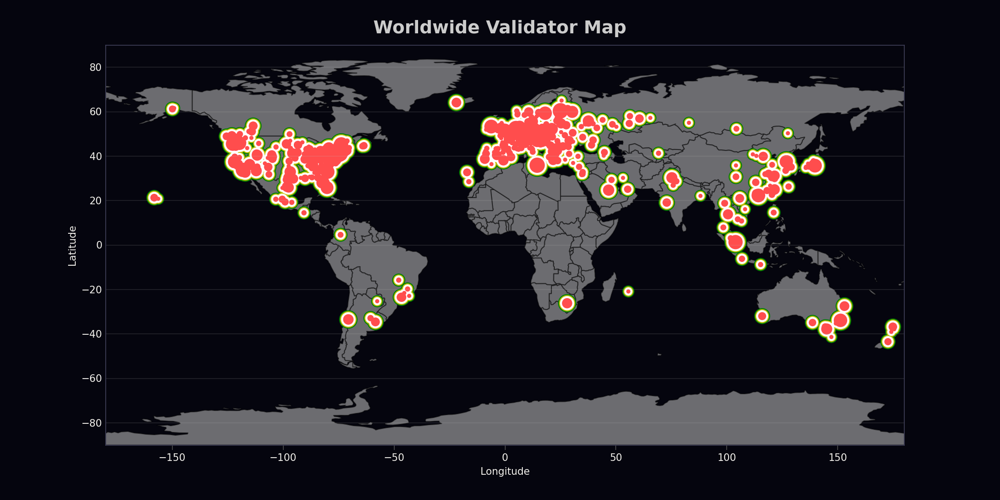

# Validator Worldmap

This repository visualizes the distribution of Ethereum validators around the globe, using data from the Ethereum Foundation Robust Incentives Group validator tracking. We fetch this data from a [Dune Analytics](https://dune.com/queries/3867590) query, then plot it on a world map with [GeoPandas](https://geopandas.org).

## License
This work is released under the CC0 1.0 Universal license. This means you can use, modify, and distribute this project without any restriction.
